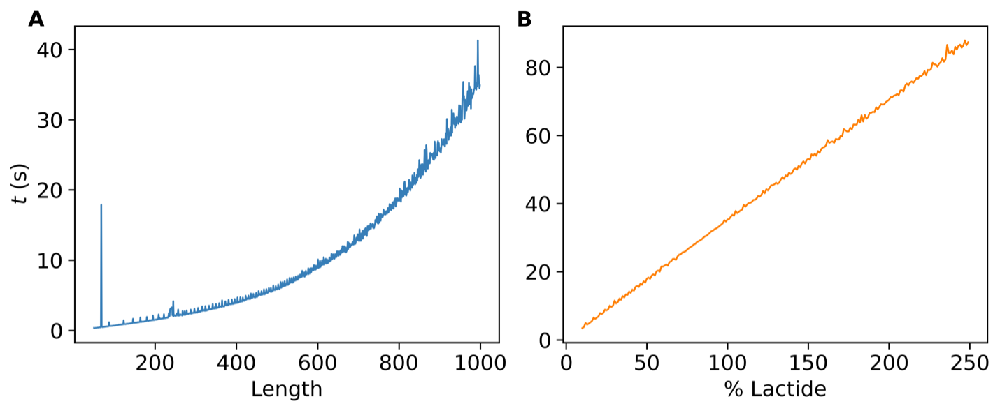

--- 
title: ‘SwiftPol:A Python package for building and parameterizing <i>in silico<i> polymer systems' 
tags: 
  - Python 
  - polymer 
  - force field 
  - molecular dynamics 
  - polydispersity 
authors: 
  - name: Hannah N. Turney 
    orcid: 0009-0002-3298-0309 
    affiliation: 1 
  - name: Micaela Matta 
    orcid: 0000-0002-9852-3154
    affiliation: 1 
affiliations: 
 - name: Department of Chemistry, King’s College London 
   index: 1 
   ror: 0220mzb33

date:  DD Month YYYY 
bibliography: paper.bib 
 
 
--- 
 
# Summary 

A polymer sample contains a natural degree of variation in its structure and non-uniformity between its chains, which influences the bulk material properties of the sample. This innate heterogeneity is often disregarded in the *in silico* study of a polymer system, resulting in divergence from experiments. This paper presents ‘SwiftPol’, a user-guided Python software for the automated generation of polydisperse polymer ensembles which reproduce the heterogeneity observed in real materials. 

# Statement of need 
MD simulations of polymers are often performed with uniform idealized systems that do not capture the heterogeneity of their experimental counterparts. The result of this misalignment is non-convergence between MD-derived polymer properties and experimental data, and these MD simulations can overlook key components of polymer physics such as polydispersity and semi-crystallinity  [@schmid_understanding_2023]. Studies have demonstrated that bulk polymer material properties such as glass transition temperature, hydrophobicity, and inherent viscosity are highly sensitive to variations in polydispersity, making it essential to account for this heterogeneity to capture the true physics of polymer systems [@li_influence_2016; @wan_effect_2021; @ochi_influence_2021]. 
Polymer MD studies showcase an assortment of approaches to manually incorporate polydispersity into their polymer chain builds [@andrews_structure_2020; @kawagoe_construction_2019; @stipa_molecular_2021]. Although effective for their associated applications, these manual approaches are not universally applicable to different polymer chemistries or are performed using proprietary software.
Open-source software packages designed to build *in silico* polymer chains are focused on the design of polymers at the monomer and single-chain scale [@davel_parameterization_2024; @ klein_hierarchical_2016; @santana-bonilla_modular_2023]. However, there is not currently a software package available that integrates these smaller-scale characteristics into computational polymer models, whilst effectively capturing the heterogeneity and polydispersity of real-life samples. The development of SwiftPol was driven by the need to fill this gap in multi-scale building functionality of existing polymer building packages, to enable the simulation of realistic polymer models.
Here, we will detail the development of SwiftPol - a user-guided Python tool for building representative polymer ensembles, and subsequent studies to show its relevance and performance. 

SwiftPol uses open-source Python libraries ‘RDkit’, OpenFF-interchange, and OpenFF-toolkit to promote reproducibility and portability [@landrum_rdkitrdkit_2024; @thompson_openff_2024; @wagner_openforcefieldopenff-toolkit_2024; @wang_open_2024].  We have ensured that SwiftPol can be seamlessly integrated into existing open-source software built for parameterization and simulation, to allow the user to select their preferred force field, topology format, and engine.

# Package Overview 

The SwiftPol build module contains Python functions to build both single polymer chains and polydisperse polymer chain ensembles. 

SwiftPol takes as an input the simplified molecular-input line-entry system (SMILES) string of all co-monomers, as well as values representing the target average properties of the ensemble: monomer % composition (for copolymers), length, number of chains, blockiness (for blocky copolymers), terminals, residual monomer. The user must define the reaction SMARTS which describes the polymerization reaction associated with their polymer chemistry. 

As depicted in \autoref{Figure 1}, SwiftPol generates an initial polymer chain with a chain length drawn from a normal distribution centered around the specified target length, along with a terminal group that corresponds to the chosen input. In the case of a block copolymer, a probability function is used to determine the ratio of monomers in the chain and the chain is passed to a second function which tests whether the values for blockiness and % monomer are within 10% of the input variable by default. The +/- 10% acceptance margin introduces polydispersity into the ensemble by ensuring a certain level of non-uniformity between polymer chains, without straying too far from the input value. The acceptance margin can be adjusted by the user to control the level of polydispersity in the SwiftPol ensemble.

If all tests are passed, the chain is appended to the Python polymer ensemble build object, and the associated properties of the chain are calculated and added as ensemble attributes. Otherwise, the chain is discarded, and the process is repeated. Once the ensemble size is satisfied, average properties are calculated using built-in SwiftPol functions. 

 

This approach allows for the generation of a polydisperse chain ensemble, meaning each chain displays different properties but the ensemble matches the target properties and distribution, as is observed in experimental polymer samples. 

SwiftPol also contains functions to generate conformers using RDkit or OpenEye (license-dependent), pack periodic boxes using packmol, and assign force field parameters to the polydisperse ensembles using the openff-interchange infrastructure [@hawkins_comparison_2007]. 

# Application: building a poly(lactide-co-glycolide) ensemble

Using SwiftPol, we have successfully constructed polydisperse ensembles of poly(lactide-co-glycolide) (PLGA), a widely used biodegradable polymer. We used the molecular structures and properties of experimental PLGA products as input for SwiftPol building functions to create representative PLGA systems to be used for molecular dynamics simulations. By integrating experimental data, such as chain terminals, copolymer ratios of lactic and glycolic acid, and blockiness, we have been able to replicate the bulk characteristics of various commercial polymer products, namely polydispersity. 
A full example implementation of SwiftPol for building PLGA systems can be found in the [building a PLGA system example notebook.](Example_Notebooks/PLGA_demo.ipynb)
We used SwiftPol to build ‘product X’, a commercially available 75:25 LA:GA ester-terminated PLGA. Following the chain build, another SwiftPol function was used to calculate the appropriate box size for the unit cell, number of water molecules, NaCl molecules, and residual monomer molecules to include in the complete condensed polymer ensemble.
The input values for the SwiftPol builder, seen in \autoref{tab:Table 1}, were taken from quality assurance documents provided by the manufacturer of product X, except the value for blockiness which was measured experimentally by Sun et al [@sun_characterization_2022].
[Input parameters for SwiftPol polymer builder function, for the building of product X.]\label{tab:Table 1}

\begin{flushleft}
\begin{table}[h!]
\captionsetup{justification=raggedright,singlelinecheck=false}
\caption{Input parameters for SwiftPol PLGA builder function, for the building of product X.}
\begin{tabular}{|l|l|}
\hline
\textbf{INPUT} & \textbf{VALUE} \\
\hline
\hline
SYSTEM SIZE & 3 \\
TARGET LACTIDE PROPORTION (\%) & 75 \\
DEGREE OF POLYMERIZATION (MONOMER) & 50 \\
TARGET CHAIN BLOCKINESS & 1.7 \\
TERMINAL & Ester \\
RESIDUAL MONOMER (\% W/W) & 0.05 \\
NACL CONCENTRATION (M) & 0.1 \\
\hline
\end{tabular}
\label{tab:Table 1}
\end{table}
\end{flushleft}

The system attributes assigned by SwiftPol to the completed condensed PLGA unit cell are in seen in \autoref{tab:Table 2},

\begin{flushleft}
\begin{table}[h!]
\captionsetup{justification=raggedright,singlelinecheck=false}
\caption{SwiftPol system build attributes. x̄n = mean value of attribute across n chains.}
\begin{tabular}{|l|l|}
\hline
\textbf{ATTRIBUTE} & \textbf{X̄N } \\
\hline
\hline
SYSTEM SIZE (CHAINS) & 3 \\
ACTUAL LACTIDE PROPORTION (\%) & 68.9 \\
AVERAGE CHAIN BLOCKINESS & 1.65 \\
AVERAGE MOLECULE WEIGHT (DALTON) & 3370 \\
AVERAGE CHAIN LENGTH (MONOMERS) & 50 \\
POLYDISPERSITY INDEX  & 1.68 \\
BUILD TIME (S)  & 1.4 \\
\hline
\end{tabular}
\label{tab:Table 2}
\end{table}
\end{flushleft}

# Speed Benchmarking
We determined whether SwiftPol can build polymer ensembles and chains with sizes that are relevant to the system scales of interest by performing a stress test. \autoref{Figure 2} shows measurements of the time benchmarking results, illustrating that SwiftPol can build large-scale systems in a realistic time frame, and will not create a bottleneck in a MD workflow.

 

# Conclusion 

We presented SwiftPol, an open-source Python package for building polydisperse *in silico* polymer ensembles. SwiftPol recreates core characteristics of bulk polymer materials like polydispersity, creating representative systems that capture key components of polymer physics. We have shown that building longer chains and larger systems, exceeding what would be appropriate for atomistic MD, will not create a time bottleneck in the MD workflow. SwiftPol is a robust and scalable tool for the guided generation of polydisperse polymer mixtures, which can be easily integrated into existing open-source MD software, such as the OpenFF toolkit.

# Defining Polymer Properties 

SwiftPol uses the following expressions to define key polymer properties. 

Monomer ratio, *R~m*, is the ratio of monomer A to monomer B in an AB copolymer, shown in \autoref{equation 1} 

\begin{equation}\label{equation 1} 
\mathit{R_{m}} = \frac{n(A)}{n(A+B)} 
\end{equation} 

Degree of polymerization, DOP, is the mean polymer chain length in the system, shown in \autoref{equation 2}. 

\begin{equation}\label{equation 2} 
DOP = \overline{x}(nA+nB) 
\end{equation} 

Number of chains, n~chains, is the total number of chains built by SwiftPol and appended to the object, shown in \autoref{equation 3}. 

\begin{equation}\label{equation 3} 
n_{chains} = total\,number\,of\,chains\,built 
\end{equation} 

Blockiness, *b*, is a measurement of the distribution of monomers in an AB copolymer, shown in \autoref{equation 4}. 

\begin{equation}\label{equation 4} 
\mathit{b} = \frac{nB-B\,bonds}{nA-B\,bonds} 
\end{equation} 

Residual monomer, *M~resid*, is the % of residual monomer molecules in the system, shown in \autoref{equation 5}. 

\begin{equation}\label{equation 5} 
\mathit{M_{resid}} = \frac{M_{w}(M_(resid))}{M_{w}(Carbon-containing\,compounds)} 
\end{equation} 

# Acknowledgements 

Hannah Turney is supported by funding contributions from the UKRI Biotechnology and Biological Sciences Research Council (grant ref. BB/T008709/1) and Johnson&Johnson Innovative Medicine. 
We acknowledge contributions and feedback from Jeffrey Wagner at the Open Force field consortium and Anusha Lalitha, David Hahn, and Gary Tresadern at Johnson&Johnson Innovative Medicine.
We acknowledge the use of King’s College London e-research Computational Research, Engineering and Technology Environment (CREATE) high-performance computing facility in the development and testing of SwiftPol.

# References 

Andrews, J.; Handler, R. A.; Blaisten-Barojas, E. Structure, Energetics and Thermodynamics of PLGA Condensed Phases from Molecular Dynamics. Polymer 2020, 206, 122903. https://doi.org/10.1016/j.polymer.2020.122903.

Davel, C. M.; Bernat, T.; Wagner, J. R.; Shirts, M. R. Parameterization of General Organic Polymers within the Open Force Field Framework. J. Chem. Inf. Model. 2024. https://doi.org/10.1021/acs.jcim.3c01691.

Hawkins, P. C. D.; Skillman, A. G.; Nicholls, A. Comparison of Shape-Matching and Docking as Virtual Screening Tools. J Med Chem 2007, 50 (1), 74–82. https://doi.org/10.1021/jm0603365.

Kawagoe, Y.; Surblys, D.; Matsubara, H.; Kikugawa, G.; Ohara, T. Construction of Polydisperse Polymer Model and Investigation of Heat Conduction: A Molecular Dynamics Study of Linear and Branched Polyethylenimine. Polymer 2019, 180, 121721. https://doi.org/10.1016/j.polymer.2019.121721.

King's College London. (2024). King's Computational Research, Engineering and Technology Environment (CREATE). Retrieved October 28, 2024, https://doi.org/10.18742/rnvf-m076

Klein, C.; Sallai, J.; Jones, T. J.; Iacovella, C. R.; McCabe, C.; Cummings, P. T. A Hierarchical, Component Based Approach to Screening Properties of Soft Matter. In Foundations of Molecular Modeling and Simulation: Select Papers from FOMMS 2015; Snurr, R. Q., Adjiman, C. S., Kofke, D. A., Eds.; Springer: Singapore, 2016; pp 79–92. https://doi.org/10.1007/978-981-10-1128-3_5.

Landrum, G.; Tosco, P.; Kelley, B.; Rodriguez, R.; Cosgrove, D.; Vianello, R.; sriniker; Gedeck, P.; Jones, G.; NadineSchneider; Kawashima, E.; Nealschneider, D.; Dalke, A.; Swain, M.; Cole, B.; Turk, S.; Savelev, A.; Vaucher, A.; Wójcikowski, M.; Take, I.; Scalfani, V. F.; Walker, R.; Probst, D.; Ujihara, K.; tadhurst-cdd; Pahl, A.; godin, guillaume; Lehtivarjo, J.; Bérenger, F.; Bisson, J. Rdkit/Rdkit: 2024_09_2 (Q3 2024) Release, 2024. https://doi.org/10.5281/zenodo.13990314.

Li, S.-J.; Xie, S.-J.; Li, Y.-C.; Qian, H.-J.; Lu, Z.-Y. Influence of Molecular-Weight Polydispersity on the Glass Transition of Polymers. Physical Review E 2016, 93. https://doi.org/10.1103/PhysRevE.93.012613.

Ochi, M.; Wan, B.; Bao, Q.; Burgess, D. J. Influence of PLGA Molecular Weight Distribution on Leuprolide Release from Microspheres. International Journal of Pharmaceutics 2021, 599, 120450. https://doi.org/10.1016/j.ijpharm.2021.120450.

Santana-Bonilla, A.; López-Ríos de Castro, R.; Sun, P.; Ziolek, R. M.; Lorenz, C. D. Modular Software for Generating and Modeling Diverse Polymer Databases. J. Chem. Inf. Model. 2023, 63 (12), 3761–3771. https://doi.org/10.1021/acs.jcim.3c00081.

Schmid, F. Understanding and Modeling Polymers: The Challenge of Multiple Scales. ACS Polym. Au 2023, 3 (1), 28–58. https://doi.org/10.1021/acspolymersau.2c00049.

Stipa, P.; Marano, S.; Galeazzi, R.; Minnelli, C.; Laudadio, E. Molecular Dynamics Simulations of Quinine Encapsulation into Biodegradable Nanoparticles: A Possible New Strategy against Sars-CoV-2. European Polymer Journal 2021, 158, 110685. https://doi.org/10.1016/j.eurpolymj.2021.110685.

Sun, J.; Walker, J.; Beck-Broichsitter, M.; Schwendeman, S. P. Characterization of Commercial PLGAs by NMR Spectroscopy. Drug Deliv Transl Res 2022, 12 (3), 720–729. https://doi.org/10.1007/s13346-021-01023-3.

Thompson, M.; Wagner, J.; Gilmer, J. B.; Timalsina, U.; Quach, C. D.; Boothroyd, S.; Mitchell, J. A. OpenFF Interchange, 2024. https://doi.org/10.5281/zenodo.11389943.

Wagner, J.; Thompson, M.; Mobley, D. L.; Chodera, J.; Bannan, C.; Rizzi, A.; trevorgokey; Dotson, D. L.; Mitchell, J. A.; jaimergp; Camila; Behara, P.; Bayly, C.; JoshHorton; Pulido, I.; Wang, L.; Lim, V.; Sasmal, S.; SimonBoothroyd; Dalke, A.; Smith, D.; Westbrook, B.; Horton, J.; Wang, L.-P.; Gowers, R.; Zhao, Z.; Davel, C.; Zhao, Y. Openforcefield/Openff-Toolkit: 0.16.0 Minor Feature and Bugfix Release, 2024. https://doi.org/10.5281/zenodo.10967071.

Wan, B.; Andhariya, J. V.; Bao, Q.; Wang, Y.; Zou, Y.; Burgess, D. J. Effect of Polymer Source on in Vitro Drug Release from PLGA Microspheres. International Journal of Pharmaceutics 2021, 607, 120907. https://doi.org/10.1016/j.ijpharm.2021.120907.

Wang, L.; Behara, P. K.; Thompson, M. W.; Gokey, T.; Wang, Y.; Wagner, J. R.; Cole, D. J.; Gilson, M. K.; Shirts, M. R.; Mobley, D. L. The Open Force Field Initiative: Open Software and Open Science for Molecular Modeling. J. Phys. Chem. B 2024, 128 (29), 7043–7067. https://doi.org/10.1021/acs.jpcb.4c01558.

